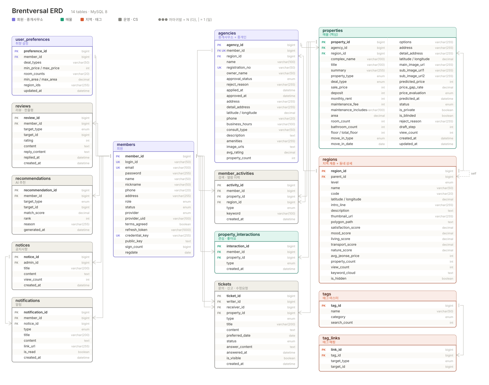
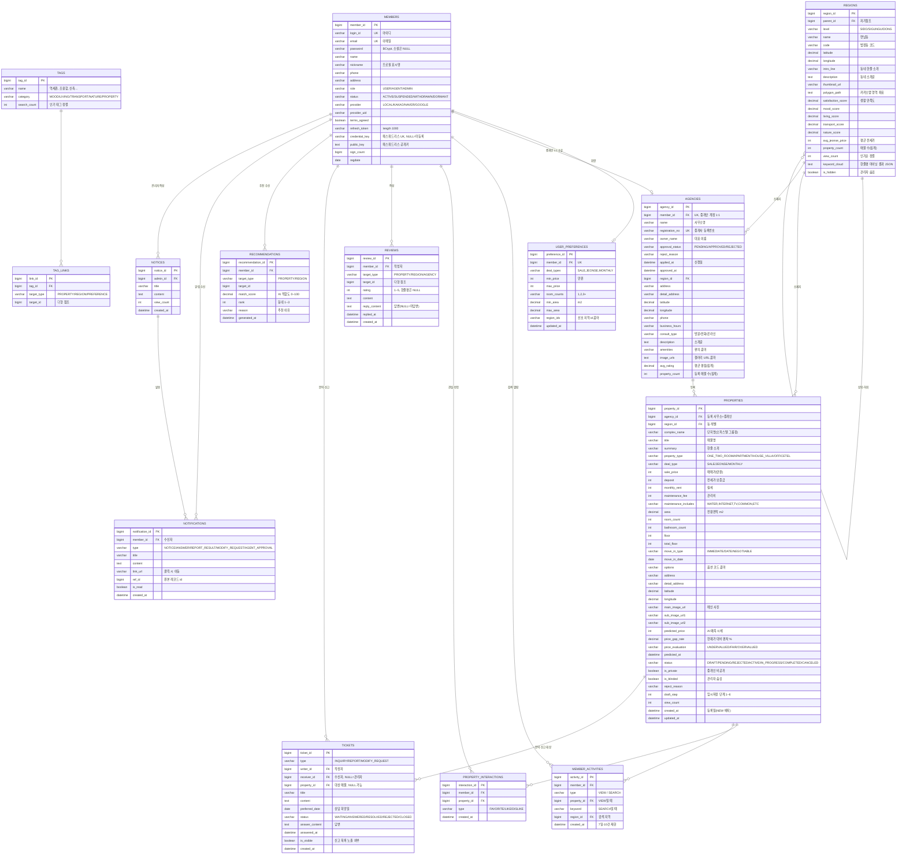

# Brentversal ERD / 엔터티 정의서 (통합본)

화면정의서(`docs/화면정의서.md`) 기준. **테이블 14개**로 통합한 최종 설계.

> **ERD 다이어그램**
> - [`docs/ERD.png`](ERD.png) — 3280 × 2586 (2x). 카톡·슬랙 공유, 보고서 삽입용
> - [`docs/ERD.svg`](ERD.svg) — 1640 × 1293 벡터. 확대해도 안 깨짐, Word·PPT 삽입용
>
> 아래 mermaid 다이어그램은 텍스트 버전(GitHub에서 렌더링됨).



- DBMS: MySQL 8
- 명명 규칙: 테이블 = 복수형 스네이크, PK = `단수명_id`, FK = `참조단수명_id`
- 공통 컬럼: `created_at`, `updated_at` (BaseTimeEntity 상속)
- 다중값 컬럼(`options`, `maintenance_includes` 등)은 **콤마 구분 문자열 + JPA `AttributeConverter`**로 처리 (`List<String>` ↔ `"A,B,C"`)

---

## 1. 통합 원칙

테이블을 나눌지 말지는 딱 3가지 기준으로 판단했다.

| 기준 | 판단 |
|------|------|
| **관계가 1:1인가?** | 1:1이면 무조건 합친다. 별도 테이블은 JOIN 비용만 늘린다. |
| **개수가 고정인가?** | 사진 3장, 예측 1건처럼 상한이 고정이면 컬럼으로 편다. |
| **그 값으로 검색·필터하는가?** | 필터 조건이면 교차 테이블(인덱스 필요), 단순 표시용이면 문자열 컬럼. |

---

## 2. 무엇을 어디에 합쳤나 (38 → 14)

| 합친 대상 | 흡수처 | 이유 |
|---|---|---|
| `agent_profiles` | **`agencies`** | 중개인 1명 = 사무소 1개(1:1). 등록번호·승인상태는 사무소 속성으로 봐도 무방 |
| `passwordless_credentials` | **`members`** | 아이디당 1개 등록. 인증 관련이라 성격도 동일 |
| `email_verifications` | **테이블 없음** | 3분 만료 임시값. 세션/캐시로 처리(DB에 남길 이유 없음) |
| `user_preference_regions`<br>`user_preference_tags` | `user_preferences.region_ids`<br>`tag_links` | 검색 조건이 아니라 추천 배치 입력값 |
| `search_histories` + `view_histories` | **`member_activities`** | "회원이 언제 뭘 했나"로 구조가 동일. `type`으로 구분 |
| `neighborhoods`<br>`neighborhood_keywords` | **`regions`** | 동네는 `regions`의 DONG 레벨 1:1 확장. 워드클라우드는 통째로 읽는 값 |
| `neighborhood_tags`<br>`property_tags` | **`tag_links`** | 구조가 완전히 같은 매핑. `target_type`으로 구분 |
| `agency_images` | `agencies.image_urls` | 갤러리 몇 장, 순서만 있으면 됨 |
| `complexes` | `properties.complex_name` | 단지는 이름으로 그룹핑만 하면 됨. 단지 자체 정보는 화면에 없음 |
| `property_images` | **`properties`** | 화면정의서가 **메인 1 + 서브 2로 고정** → 컬럼 3개 |
| `option_items` + `property_options`<br>`property_maintenance_items` | `properties.options`<br>`properties.maintenance_includes` | 체크박스 표시용, 검색 필터 아님. 옵션 마스터 관리 화면도 없음 → enum 상수 |
| `price_predictions` | **`properties`** | 매물당 최신 1건만 화면에 씀 |
| `favorites` + `property_reactions` | **`property_interactions`** | 둘 다 (회원, 매물, 행위). `type`으로 구분 |
| `weekly_deals` | **테이블 없음** | `properties.price_gap_rate ORDER BY` 쿼리로 산출 가능 |
| `property_reviews`<br>`neighborhood_reviews`<br>`agency_reviews` | **`reviews`** | 셋 다 (회원 → 대상, 평점, 내용, 답변). `target_type`으로 구분 |
| `property_recommendations`<br>`neighborhood_recommendations` | **`recommendations`** | 동일 구조 |
| `inquiries` + `inquiry_answers`<br>`reports`<br>`modification_requests` | **`tickets`** | 셋 다 (제목, 내용, 대상 매물, 상태, 답변 1회). 화면도 "이메일처럼 보이고 답변 버튼" 동일 |

---

## 3. 최종 엔터티 14개

| # | 테이블 | 역할 | 관련 화면 |
|---|--------|------|-----------|
| 1 | `members` | 일반/중개인/관리자 계정 + 패스워드리스 | 로그인, 회원가입, 회원 관리 |
| 2 | `user_preferences` | 취향 초기 설정(예산/방/면적/지역) | 취향 설정, 맞춤 추천 |
| 3 | `member_activities` | 최근 본 매물 + 검색 기록 | 관심 목록, 추천 근거 |
| 4 | `regions` | 시/도–구–동 계층 **+ 동네 상세** | 지역 드롭다운, 동네 탐색/상세 |
| 5 | `tags` | 태그 마스터(분위기/생활/교통/자연/매물) | 동네 탐색, 지도 검색 |
| 6 | `tag_links` | 태그 ↔ 매물·동네·취향 매핑 | 태그 필터 |
| 7 | `agencies` | 중개사무소 **+ 중개인 정보·승인** | 중개사무소 안내/상세, 중개인 승인 |
| 8 | `properties` | **매물(핵심)** + 사진·옵션·AI예측 | 지도 검색, 매물 상세/등록 |
| 9 | `property_interactions` | 관심(하트) + 좋아요/싫어요 | 관심 목록, 중개인 대시보드 |
| 10 | `reviews` | 매물 한줄평 + 동네 한줄평 + 사무소 리뷰 | 매물/동네/사무소 상세 |
| 11 | `recommendations` | AI 매물·동네 추천 결과 | 맞춤 추천 |
| 12 | `tickets` | 문의 + 신고 + 수정 요청 | 문의/신고/수정요청, 관리자 |
| 13 | `notices` | 공지사항 | 공지사항, 공지 작성 |
| 14 | `notifications` | 알림 | 상단바 알림, 알림 내역 |

---

## 4. 전체 ERD



---

## 5. 합치지 **않은** 것과 그 이유

줄이지 않은 데는 이유가 있다. 나중에 "이건 왜 안 합쳤지?" 소리가 나올 것들.

| 안 합친 것 | 합칠 수 있었지만 | 안 한 이유 |
|---|---|---|
| `tag_links`를 `properties.tags` 문자열로 | 컬럼 하나면 끝 | **태그가 검색 필터 조건**(지도 검색 특수조건, 동네 탐색 태그 버튼). 매물이 수만 건일 때 `LIKE '%역세권%'`은 인덱스를 못 탄다 |
| `user_preferences`를 `members`에 | 1:1이라 원칙상 합쳐야 함 | `members`는 인증할 때마다 로딩되는 테이블. 이미 컬럼 17개 + 추천 배치는 이 테이블만 스캔하면 됨. **합쳐도 무방하니 팀 판단** |
| `notices`를 `notifications`에 | 비슷해 보임 | 공지 1건 → 알림 N건(1:N). 공지는 목록/상세 페이지가 따로 있고 알림은 읽음 처리 대상 |
| `property_interactions`를 `properties`의 카운트 컬럼으로 | 좋아요 수만 세면 됨 | "**누가**" 하트를 눌렀는지 알아야 관심 목록이 만들어짐 |
| `reviews`의 답변을 별도 테이블로 | 여러 번 주고받을 수 있음 | 화면정의서상 답변은 **1회**. 필요해지면 그때 분리 |

---

## 6. 주요 Enum

| Enum | 값 |
|---|---|
| `Role` | `USER`, `AGENT`, `ADMIN` |
| `MemberStatus` | `ACTIVE`, `SUSPENDED`, `WITHDRAWN`, `DORMANT` |
| `ApprovalStatus` | `PENDING`, `APPROVED`, `REJECTED` |
| `RegionLevel` | `SIDO`, `SIGUNGU`, `DONG` |
| `PropertyType` | `ONE_TWO_ROOM`, `APARTMENT`, `HOUSE_VILLA`, `OFFICETEL` |
| `DealType` | `SALE`, `JEONSE`, `MONTHLY` |
| `PropertyStatus` | `DRAFT`, `PENDING`, `REJECTED`, `ACTIVE`, `IN_PROGRESS`, `COMPLETED`, `CANCELED` |
| `MoveInType` | `IMMEDIATE`, `DATE`, `NEGOTIABLE` |
| `PriceEvaluation` | `UNDERVALUED`, `FAIR`, `OVERVALUED` |
| `TagCategory` | `MOOD`, `LIVING`, `TRANSPORT`, `NATURE`, `PROPERTY` |
| `TargetType` | `PROPERTY`, `REGION`, `AGENCY`, `PREFERENCE` |
| `TicketType` | `INQUIRY`, `REPORT`, `MODIFY_REQUEST` |
| `ActivityType` | `VIEW`, `SEARCH` |
| `InteractionType` | `FAVORITE`, `LIKE`, `DISLIKE` |
| `NotificationType` | `NOTICE`, `ANSWER`, `REPORT_RESULT`, `MODIFY_REQUEST`, `AGENT_APPROVAL` |
| `OptionCode` | `AIRCON`, `REFRIGERATOR`, `WASHER`, `ELEVATOR`, `PARKING`, `CCTV` … (마스터 테이블 대신 enum) |

---

## 7. 제약조건 · 인덱스

```sql
-- 유니크
ALTER TABLE property_interactions ADD UNIQUE (member_id, property_id, type);
ALTER TABLE tag_links             ADD UNIQUE (tag_id, target_type, target_id);
ALTER TABLE agencies              ADD UNIQUE (member_id);
ALTER TABLE user_preferences      ADD UNIQUE (member_id);

-- 지도 검색: bounding box 조회
CREATE INDEX idx_prop_geo    ON properties (latitude, longitude);
-- 매물 목록: 상태 + 최신순
CREATE INDEX idx_prop_list   ON properties (status, created_at DESC);
-- 필터 조합
CREATE INDEX idx_prop_filter ON properties (region_id, deal_type, property_type, status);
-- 다형 참조 조회
CREATE INDEX idx_tag_target  ON tag_links (target_type, target_id);
CREATE INDEX idx_review_tgt  ON reviews (target_type, target_id);
CREATE INDEX idx_ticket_list ON tickets (type, status, created_at DESC);
```

> **다형 참조 주의**: `tag_links`, `reviews`, `recommendations`, `tickets`의 `target_id`는 FK 제약을 걸 수 없다. 대상 삭제 시 고아 레코드가 남으므로 **서비스 레이어에서 함께 삭제**하거나, 매물은 물리 삭제 대신 `status = CANCELED`로만 처리한다.

---

## 8. 기존 코드 반영 사항

- [Role.java](../brentversal/src/main/java/com/brentversal/Member/constant/Role.java) — `USER, ADMIN` → **`AGENT` 추가**
- [Member.java](../brentversal/src/main/java/com/brentversal/Member/entity/Member.java) — `login_id`, `nickname`, `phone`, `status`, `provider`, `provider_uid`, `terms_agreed`, `credential_key`, `public_key`, `sign_count` 컬럼 추가
- `ddl-auto=update`는 컬럼 추가만 하고 길이·제약 변경은 안 하므로, UNIQUE 제약과 인덱스는 위 SQL로 직접 적용
